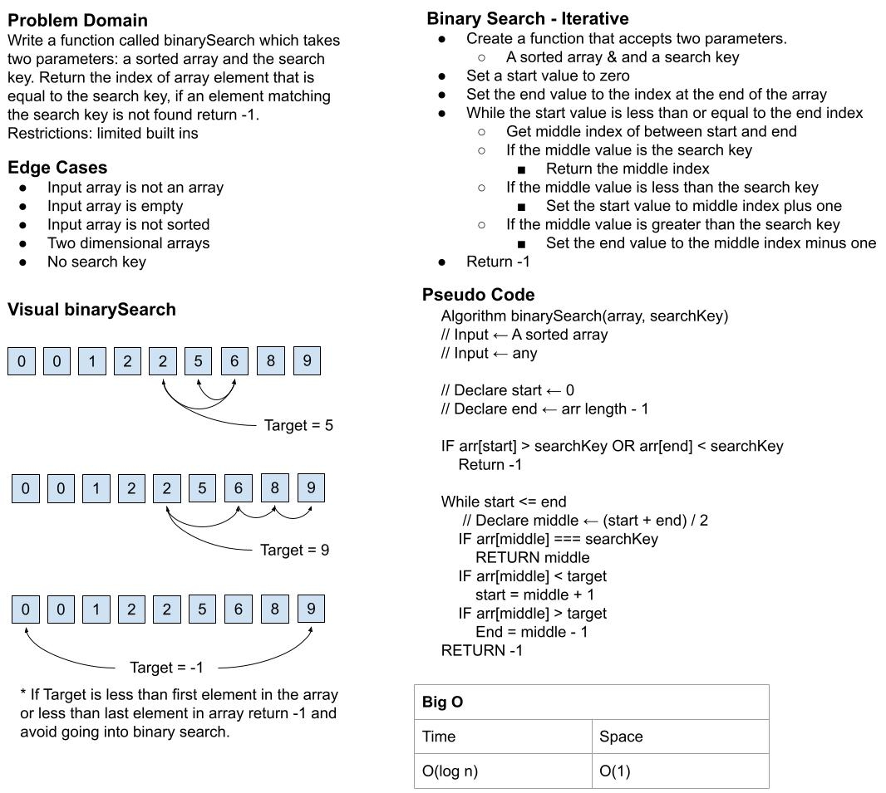

# Binary Search of Sorted Array
Write a function called BinarySearch which takes in 2 parameters: a sorted array and the search key. Without utilizing any of the built-in methods available to your language, return the index of the array’s element that is equal to the value of the search key, or -1 if the element is not in the array.

## Whiteboard Process

## Approach & Efficiency
I took the approach of the while loop because I knew I had to return the value. If I had used recursion I would have only be able to return true or false if the value was in the array and would have suffered a reduction in space efficiency to `O(log N)`.

| Time | Space |
| --- | --- |
| `O(log N)` |  `O(1)` |
