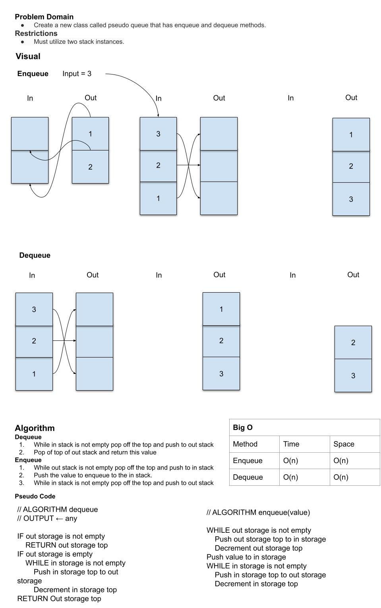

# Challenge Summary
Create a new class called pseudo queue. Implement our standard queue using two stack instances.

## Methods
`enqueue`
  - Inserts value into the PseudoQueue, using a first-in, first-out approach.

`dequeue`
  - Extracts a value from the PseudoQueue, using a first-in, first-out approach.

## Whiteboard Process


## Approach & Efficiency
| Method | Time Complexity | Space Complexity |
| ---- | ---- | ---- |
| enqueue | O(n) | O(n) |
| dequeue | O(n) | O(n) |

## Run Solution

```Bash
# Install dependencies
npm install

# run jest tests for stack-queue-pseudo
npm test stack-queue-pseudo.test.js
```

### Sources

[Enqueue & Dequeue - Stack Overflow](https://stackoverflow.com/a/69436)
